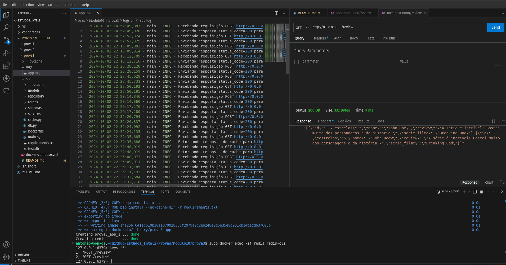

# ApplicationReviewAPI
ApplicationReviewAPI é uma API simples para gerenciar avaliações de filmes e séries, permitindo que usuários criem, atualizem, visualizem e excluam avaliações. Construída com FastAPI, SQLAlchemy e Redis, ela oferece uma solução eficiente com caching e sistema de logging integrado.



## Funcionalidades

- Adicionar uma nova avaliação
- Ver todas as avaliações
- Ver uma avaliação específica
- Atualizar uma avaliação existente
- Excluir uma avaliação

## Tecnologias Utilizadas

A aplicação foi construída utilizando as seguintes tecnologias:

- **[FastAPI](https://fastapi.tiangolo.com/)**: Um framework moderno e rápido para a criação de APIs com Python.
- **[SQLAlchemy](https://www.sqlalchemy.org/)**: Uma biblioteca SQL poderosa para Python, utilizada para interagir com o banco de dados relacional.

## Como Rodar com Docker

### Pré-requisitos

- [Docker](https://www.docker.com/) instalado na sua máquina.

### Passos
## Como Rodar com Docker Compose

Além de rodar a aplicação diretamente com o Docker, você também pode usar o `docker-compose` para simplificar a execução, especialmente se você quiser configurar volumes ou executar vários serviços.

### Passos

1. Construa e suba os serviços utilizando o `docker-compose`:

    ```bash
    sudo docker-compose up --build
    ```

    Isso irá construir a imagem do backend e subir a aplicação na porta `8000`.

2. Acesse a documentação interativa da API:

    Após o contêiner ser iniciado com sucesso, abra seu navegador e acesse [http://127.0.0.1:8000/docs](http://127.0.0.1:8000/docs) para visualizar a documentação interativa da API, onde você pode testar todos os endpoints.

3. Os logs da aplicação serão salvos no diretório `logs/app.log` do projeto, caso precise acessar informações de execução da aplicação.

## Funcionalidades Adicionadas

Além das funcionalidades básicas de criação, atualização, visualização e exclusão de avaliações, os seguintes recursos foram implementados:

- **Sistema de Logging**:
  - Todos os requests e responses da API são registrados, incluindo o método HTTP, a URL requisitada, o código de status da resposta e o tempo de processamento.
  - Os logs são armazenados em um arquivo `logs/app.log` para facilitar a análise e monitoramento da aplicação.
  - Logs também são exibidos no console durante a execução para acompanhamento em tempo real.

- **Estrutura de Middleware para Logs**:
  - Um middleware foi adicionado para capturar informações de cada requisição e resposta, permitindo que o tempo de processamento seja medido e registrado.
  - As informações logadas incluem o método HTTP (GET, POST, PUT, DELETE), o status de resposta (ex: 200, 404) e o tempo total de resposta para cada requisição.

Com essas funcionalidades, a aplicação fica mais robusta e pronta para ser monitorada em ambientes de produção, garantindo que todos os eventos críticos sejam registrados para uma eventual análise.


## Sistema de Cache com Redis

A aplicação também implementa um sistema de cache utilizando o **Redis**. O cache é usado para armazenar as respostas das requisições e acelerar o tempo de resposta das requisições subsequentes, especialmente em endpoints que retornam dados que não mudam com frequência.

### Como o cache funciona

1. **Geração de Chaves de Cache**:
   - Para cada requisição recebida pela API, uma chave única de cache é gerada com base no método HTTP (GET, POST, etc.) e no caminho da URL. Essa chave é então usada para armazenar e recuperar a resposta do cache.
   - Exemplo de chave: `"GET_/reviews"`.

2. **Armazenamento no Redis**:
   - A resposta da API é processada normalmente e, se a resposta tiver o código de status `200`, ela é armazenada no Redis utilizando a chave gerada. O tempo de vida padrão (TTL) da chave no Redis é de 300 segundos (5 minutos).

3. **Verificação do Cache**:
   - Para cada nova requisição, o sistema verifica se já existe uma resposta correspondente armazenada no Redis. Se sim, a resposta cacheada é retornada diretamente, sem precisar processar a lógica da API novamente, economizando recursos e reduzindo o tempo de resposta.

4. **Expiração do Cache**:
   - O cache armazenado no Redis expira automaticamente após 5 minutos, após o qual novas requisições para o mesmo endpoint resultarão no processamento completo da API, e a resposta será novamente armazenada no cache.

### Verificando o cache no Redis

1. **Ver as chaves no Redis**:
   Para verificar quais chaves estão armazenadas no Redis, você pode usar o seguinte comando no Redis CLI:
   ```bash
   redis-cli KEYS *
   ```

Isso listará todas as chaves de cache atualmente armazenadas no Redis.

2. Ver o valor de uma chave específica: Para ver o conteúdo armazenado em uma chave específica, use o comando:

   ```bash
  redis-cli GET <chave>
   ```

Por exemplo, se a chave for "GET_/reviews", o comando seria:

```bash
redis-cli GET GET_/reviews
```

### Problema com a Formatação do JSON no Cache
Durante a implementação do sistema de cache, foi identificado um problema com a formatação das respostas JSON. Ao recuperar a resposta do cache, a formatação JSON pode vir corrompida, resultando em respostas malformadas para o cliente.

**Causa**
O problema ocorre porque o corpo da resposta é tratado como uma string e armazenado diretamente no Redis, sem a devida serialização e desserialização utilizando JSON, o que pode levar a problemas de escape de caracteres e duplicação de barras invertidas (\).

